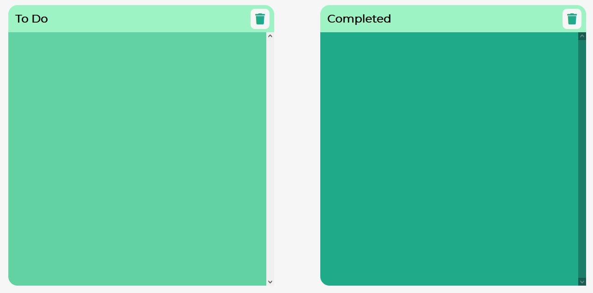
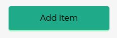
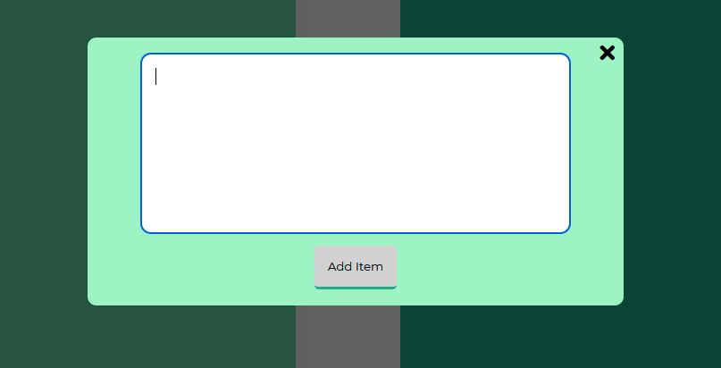
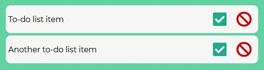
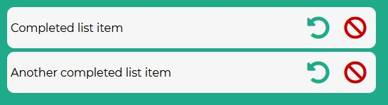
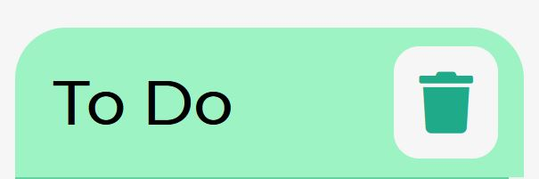
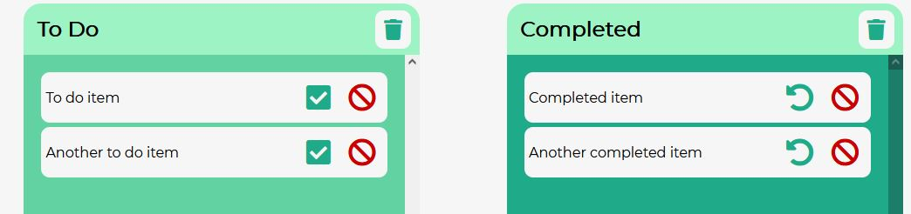
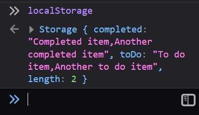

# To-Do List

This website is a fully responsive JavaScript to-do app that allows users to add, delete, check and uncheck notes. The site is targeted towards people who want a simple to-do list interface in the browser that saves their notes for next time they visit the page. 

The site is designed to be responsive across all devices, making it easy to use for all potential site visitors.

## User Experience (UX)

### User Stories:

* The user wants a place to create and delete notes.
* The user is looking for a simple site that is easy to use.
* The user wants to be able to keep track of their notes by marking/un-marking them as complete.
* The user wants their previously made notes to persist after leaving the site.
* The user wants to be able to get in touch with any queries/issues they're experiencing.

### Design

* Colour Scheme 
    * The colours used across the site are a mix of blue/green shades. They are all cool tones, which are not to harsh on the eye.
* Typography 
    * The Montserrat font is used across the page, with Sans-Serif as the fallback. This font is clear and simple, and does not distract the user too much. It's simplicity is well suited to an app of this nature.
* Imagery 
    * While there are no images present on the site, the icons and style used is clean and coherent, with colours appropriately matched across the page.

## Features

### Existing Features

* Note Area
    * The note area is the central focus of the page. It is immediately clear to the user and is where all to-do/completed items are stored for the user to easily view.

* Add Note Section
    * This section is where users will type in their notes. The user first clicks on the "Add Item" button to bring up a popup modal. This modal gives the user a large textbox so they can write long notes. As this modal appears, the background is darkened so the user can focus on solely the popup.
    * There is a check in the code to ensure the user has entered some text before the note is added. The user will be alerted if the textbox is empty upon submitting.

* To-Do List Items
    * When an item is initially added to the list, it will first appear in the "To Do" section, so the user knows the task is still to be completed.
    * Each item can be checked off; this will move the item over to the "Completed" section.
    * Each item can be deleted; this removes the item from the list.

* Completed List Items
    * When a to-do item is marked as complete using the check button, it is moved over to the completed section.
    * Each item can be marked as incomplete by clicking the "undo" button. This moves the item back over to the "To Do" section.
    * Each item can be deleted; this removes the item from the list.

* Clear All Buttons
    * Both the "To Do" and "Completed" sections have trash icons at the top. This button clears all list items from the respective section.

* Items Saved to Local Storage
    * Users' notes are saved to localStorage and loaded on page load.
    * localStorage is amended every time an aforementioned feature is actioned.
    * When the user adds an item, it is added to the toDo value in localStorage/
    * When the user checks an item or unchecks an item, it is moved over to the respective location in localStorage.
    * When the user deletes or clears items, the items are deleted from the appropriate location in localStorage.

