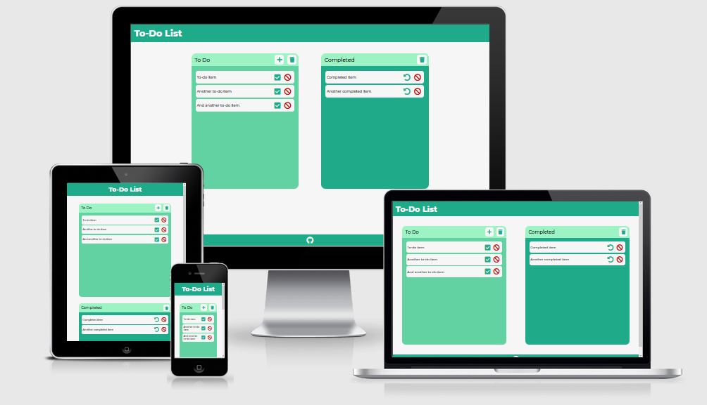

# To-Do List

[View deployed site](https://jacobshortall.github.io/to-do-app)

This website is a fully responsive JavaScript to-do app that allows users to add, delete, check and uncheck notes. The site is targeted towards people who want a simple to-do list interface in the browser that saves their notes for next time they visit the page.

The site is designed to be responsive across all devices, making it easy to use for all potential site visitors.

## User Experience (UX)

### User Stories:

-   The user is looking for a simple site that is easy to use.
-   The user wants a place to create notes.
-   The user wants to be able to delete notes.
-   The user wants to be able to keep track of their notes by marking/un-marking them as complete.
-   The user wants their previously made notes to persist after leaving the site.
-   The user wants to their notes to sync across tabs without having to refresh the page.
-   The user should be limited on characters and be given feedback about when they're running out.

### Design

-   Colour Scheme
    -   The colours used across the site are a mix of blue/green shades. They are all cool tones, which are not too harsh on the eye.
-   Typography
    -   The Montserrat font is used across the page, with Sans-Serif as the fallback. This font is clear and simple, and does not distract the user too much. It's simplicity is well suited to an app of this nature.
-   Imagery
    -   While there are no images present on the site, the icons and style used is clean and coherent, with colours appropriately matched across the page.

### Project Wireframes

-   [Desktop View](readme/wireframes/desktop.png)
-   [Mobile View](readme/wireframes/mobile.png)

## Features

### Existing Features

-   Note Area

    -   The note area is the central focus of the page. It is immediately clear to the user and is where all to-do/completed items are stored for the user to easily view.

-   Add Note Section

    -   This section is where users will type in their notes. The user first clicks on the "Add Item" button to bring up a popup modal. This modal gives the user a large textbox. As this modal appears, the background is darkened so the user can focus on solely the popup.
    -   There is a check in the code to ensure the user has entered some text before the note is added. The user will be alerted if the textbox is empty upon submitting.
    -   There is a character counter in the modal that lets the user know how many more characters they are able to type before hitting the limit of 150.

-   To-Do List Items

    -   When an item is initially added to the list, it will first appear in the "To Do" section, so the user knows the task is still to be completed.
    -   Each item can be checked off; this will move the item over to the "Completed" section.
    -   Each item can be deleted; this removes the item from the list.

-   Completed List Items

    -   When a to-do item is marked as complete using the check button, it is moved over to the completed section.
    -   Each item can be marked as incomplete by clicking the "undo" button. This moves the item back over to the "To Do" section.
    -   Each item can be deleted; this removes the item from the list.

-   Clear All Buttons

    -   Both the "To Do" and "Completed" sections have trash icons at the top. This button clears all list items from the respective section.

-   Items Saved to Local Storage

    -   Users' notes are saved to localStorage and loaded on page load.
    -   localStorage is amended every time an aforementioned feature is actioned.
    -   When the user adds an item, it is added to the toDo value in localStorage.
    -   When the user checks an item or unchecks an item, it is moved over to the respective location in localStorage.
    -   When the user deletes or clears items, the items are deleted from the appropriate location in localStorage.

-   Items Sync Between Tabs
    -   When localStorage changes in any way, the changes will be instantly implemented in all tabs without having to reload the page.

### Features to Implement in the Future

-   Database usage for user notes instead of localStorage.
    -   localStorage has constraints that would be resolved if a database was used. For example, localStorage can only store around 5MB of data. It also requires more logic to retrieve data as it's all stored in a string.
-   Drag and drop movement for notes.
-   Multiple notebooks that the user can switch between.
-   Pagination for note section overflow instead of current implementation (scroll).

## Technologies

### Languages Used

-   HTML5
-   CSS3
-   JavaScript

### Frameworks, Libraries and Programs Used

-   [Google Fonts](https://fonts.google.com/)
    -   This project uses Google Fonts to style fonts across the website.
-   [Font Awesome](https://fontawesome.com/)
    -   This project uses the Font Awesome CDN for icons across the website.
-   [Balsamiq](https://balsamiq.com/)
    -   Balsamiq was used for creating the wireframes used to design the project.
-   [Git](https://git-scm.com/)
    -   Git was used for version control, using Git Bash terminal for Windows to commit, push and merge code.
-   [Github](https://github.com/)
    -   Github is used to store the project after being pushed to Git. It is also used for hosting the site.
-   [Prettier](https://prettier.io/)
    -   Prettier was used for formatting all of the HTML, CSS and JavaScript code.
-   [ESLint](https://eslint.org/)
    -   The Airbnb ESLint configuration was used to lint code to an industry-standard level.

## Testing

Find testing information in this separate file: [TESTING.md](readme/TESTING.md)

## Deployment

This project is hosted on Github Pages. This method is as follows:

-   Log in to Github at https://github.com/
-   Navigate to the project repository you wish to host on Github Pages.
-   Click on "Settings" in the menu bar above the repo.
-   In the menu bar to the left on the settings page, click "Pages"
-   Under "Source", select the dropdown for "Branch" and select "master", or "main" in other cases, and then ensure that the correct directory is selected. In this case it is "root".
-   Click save, give up to 5 minutes for the site to deploy. A message will read "Your site is published at..." at the top of the "Pages" page.

## Credits

### Code

-   All code is unique and written by the developer.

### Content

-   All content was written by the developer.

### Acknowledgements

-   Thank you to my mentor for support through the stages of this project.
